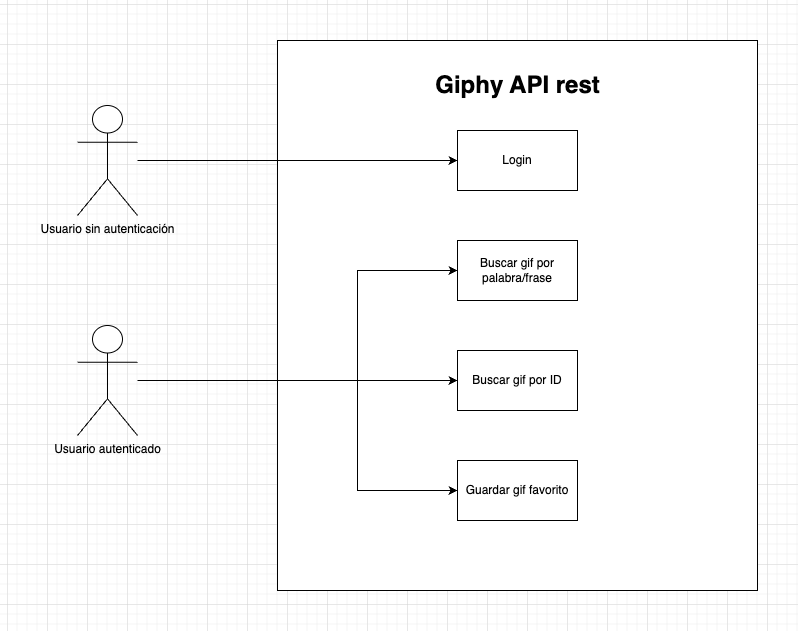
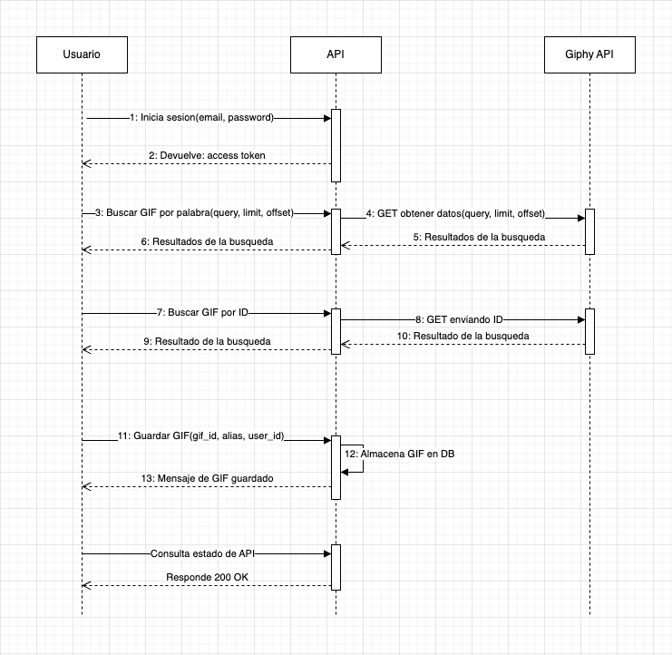
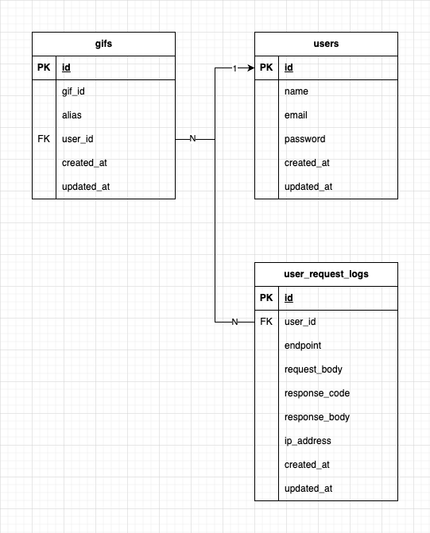

<p align="center"><a href="https://laravel.com" target="_blank"></a></p>

---

<p align="center">
  <a href="https://www.php.net/" style="margin-right: 15px;">
    
  </a>
  <a href="https://laravel.com/" style="margin-right: 15px;">
    
  </a>
  <a href="https://www.mysql.com/" style="margin-right: 15px;">
    
  </a>
  <a href="https://www.docker.com/">
    
  </a>
</p>

# Giphy api rest

Esta es una API rest hecha con laravel y PHP, para realizar consultas a la api rest https://developers.giphy.com/

## Requisitos Previos

Asegúrate de tener instalados los siguientes programas en tu máquina:

- [Docker](https://www.docker.com/get-started)
- [Docker Compose](https://docs.docker.com/compose/install/)

## Instalación

Sigue estos pasos para instalar y configurar el proyecto:

1. **Clona el repositorio**:

   ```bash
   git clone https://github.com/tu-usuario/tu-repo.git
   cd tu-repo
   
## Diagrama de casos de uso


## Diagrama de secuencia


## Diagrama DER


## Colección de Postman
Puedes encontrar la colección de Postman en la carpeta [`docs/postman/challenge-prex-php.postman_collection`](docs/postman/challenge-prex-php.postman_collection).