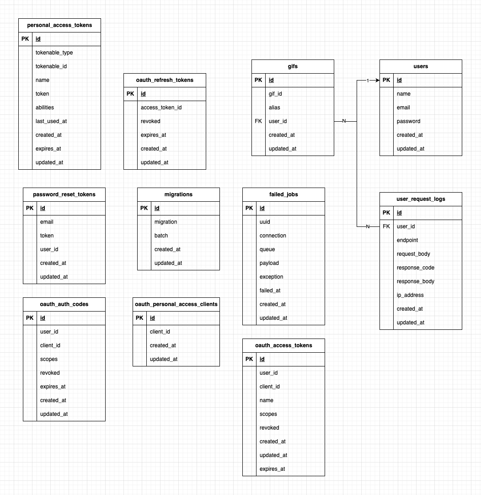

<p align="center"><a href="https://laravel.com" target="_blank"></a></p>

---

<p align="center">
  <a href="https://www.php.net/" style="margin-right: 15px;">
    
  </a>
  <a href="https://laravel.com/" style="margin-right: 15px;">
    
  </a>
  <a href="https://www.mysql.com/" style="margin-right: 15px;">
    
  </a>
  <a href="https://www.docker.com/">
    
  </a>
</p>

# Giphy api rest

Esta es una API rest hecha con laravel y PHP, para realizar consultas a la api rest https://developers.giphy.com/

## Requisitos Previos

Asegúrate de tener instalados los siguientes programas en tu máquina:

- [Docker](https://www.docker.com/get-started)
- [Docker Compose](https://docs.docker.com/compose/install/)
- [Git](https://git-scm.com/)

## Instalación

Sigue estos pasos para instalar y configurar el proyecto:

1. **Clona el repositorio**:

   ```bash
   - SHH: git clone git@github.com:ayrtoncravero/challenge-prex-php.git
   - HTTPS: https://github.com/ayrtoncravero/challenge-prex-php.git
   - cd challenge-prex-php
2. **Cargar env**:
   ```bash
     - cp .env.example .env
- Llenar keys de DB

3. **Configuración del entorno Docker (todos los comandos deben ejecutarse en el src)**:

   - **Construir imágenes necesarias**:
     ```bash
     docker-compose up -d --build
     ```

   - **Verifica que los contenedores estén corriendo**:
     ```bash
     docker-compose ps
     ```

   - **Instalar dependencias**:
     ```bash
     docker-compose exec php composer install
     ```

   - **Generar la clave de aplicación**:
     ```bash
     docker-compose exec php php artisan key:generate
     ```

   - **Crear DB**:
     - **Acceder al contenedor de MySQL**:
       - Asegúrate de que coincida con lo definido en tu archivo `.env` en `DB_PASSWORD`.
       ```bash
       docker-compose exec db mysql -u root -p
       ```

     - **Crear la DB**:
       - Asegúrate de que coincida con lo definido en tu archivo `.env`.
       ```sql
       CREATE DATABASE nombre_de_tu_base_de_datos;
       ```

     - **Para salir del cliente de MySQL, utiliza el comando**:
       ```bash
       exit;
       ```

   - **Correr migraciones y ejecutar seeders**:
     ```bash
     docker-compose exec php php artisan migrate --seed
     ```

   - **Para validar el correcto inicio, dirígete a**: [http://localhost:8000/](http://localhost:8000/) -> Cambia el puerto por el que hayas configurado en el `docker-compose.yml`.
   
## Diagrama de casos de uso


## Diagrama de secuencia


## Diagrama DER


## Colección de Postman
Puedes encontrar la colección de Postman en la carpeta [`docs/postman/challenge-prex-php.postman_collection`](docs/postman/challenge-prex-php.postman_collection).